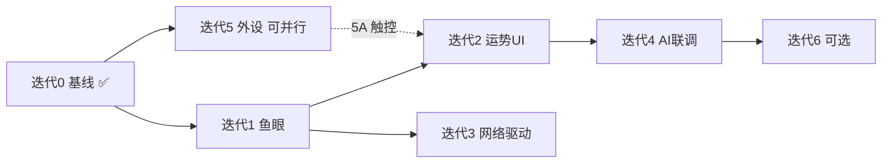

# AI 罗盘 — 需求迭代拆分与验收清单

> **来源文档**: [`ai_compass_product_and_tech_spec.md`](ai_compass_product_and_tech_spec.md) v1.6  
> **目标硬件**: Waveshare ESP32-S3-Touch-LCD-1.85B  
> **文档版本**: v1.1  
> **更新日期**: 2026-06-15  
> **用途**: 将产品技术方案中的需求拆解为可交付迭代，并为每轮迭代提供可勾选的验收清单。

---

## 1. 文档说明

### 1.1 与源文档的关系

| 源文档章节 | 本清单对应内容 |
|-----------|---------------|
| §1 产品概述 / §1.1.1 固件集成 | 迭代 5（外设）、迭代 0 基线 |
| §2 核心功能模块 | 迭代 0（`R-VOICE-*` / `R-DISP-*` / `R-MCP-*`） |
| §4 新增功能方案 | 迭代 2、迭代 4（`R-FORT-*`） |
| §5 显示系统 | 迭代 0 ~ 3 视觉验收 |
| §6 构建与烧录 | §11.1 `R-BUILD-*` |
| §7 开发路线图 + §7.0 对照表 | 迭代 0 ~ 6 主结构 |
| §8 ~ §11 性能/稳定性/工具链 | §11.2 ~ §11.4 `R-PERF-*` / `R-STAB-*` / `R-TOOL-*` |
| 附录 A Target1 | 历史参考，**不实施**；运势高亮见迭代 2 Target2 定义 |

### 1.1.1 阶段 ↔ 迭代对照（与产品规格 §7.0 一致）

| 产品规格「阶段」 | 本清单「迭代」 |
|----------------|---------------|
| 阶段一 | 迭代 0 |
| 阶段二 | 迭代 1 |
| 阶段三 | 迭代 2 |
| 阶段四 | 迭代 3 |
| 阶段五 | 迭代 4 |
| 阶段六 | 迭代 6 |
| （规格未单列） | **迭代 5** 板载外设驱动 |

### 1.2 状态图例

| 标记 | 含义 |
|------|------|
| ✅ | 已完成并通过验收 |
| 🟡 | 进行中 / 部分完成 |
| ⬜ | 未开始 |
| ❌ | 已废弃（不再实施） |

### 1.3 统一验收环境

- **板卡**: Waveshare ESP32-S3-Touch-LCD-1.85B  
- **编译烧录**: `.\build_and_flash.ps1`（Windows）或 `./build_and_flash.sh`（Linux/macOS）  
- **串口**: USB-Serial/JTAG（Windows 示例 `COM9`）  
- **截图验证**: `docs-skills/esp32-lvgl-compass/scripts/snapshot_recv.py -p <PORT> --reset`  
- **日志**: `idf.py -p <PORT> monitor`，关注 TAG：`main` / `Application` / `SnapshotService` / `CompassTaiji`

---

## 2. 迭代总览

| 迭代 | 名称 | 状态 | 预估工期 | 前置依赖 | 交付物 |
|------|------|------|---------|---------|--------|
| **0** | 基础罗盘与平台基线 | ✅ 已完成 | — | — | Target2 罗盘 UI + Xiaozhi 基础能力 |
| **1** | 鱼眼状态图标（伪旋转） | ⬜ 未开始 | ~1 周 | 迭代 0 | WiFi/BLE 双鱼眼 UI + 手动状态切换 |
| **2** | AI 运势三态 + 结果卡 | ⬜ 未开始 | ~2 周 | 迭代 1 | Idle/Animating/Result 状态机 + 200×240 卡片 |
| **3** | 真实 WiFi/BLE 驱动鱼眼 | ⬜ 未开始 | ~1.5 周 | 迭代 1 | esp_event / NimBLE → 鱼眼状态联动 |
| **4** | AI 服务端运势 MCP 联调 | ⬜ 未开始 | ~1 周 | 迭代 2 | 语音指令端到端触发运势流程 |
| **5** | 板载外设驱动补齐 | ⬜ 未开始 | ~2~3 周 | 迭代 0 | 触控/编解码/IMU/电量/RTC 接入 |
| **6** | 增强与优化（可选） | 🟡 部分 | ~2~3 周 | 迭代 2~5 | 节气/历史/IMU 姿态/手势等 |

**建议实施顺序**: 0（维持）→ 1 → 2 → 3 → 4；迭代 5 可与 1~2 并行；迭代 6 按需插入。

**最短 MVP 路径**（不含迭代 5/6）: 迭代 1 → 2 → 3 → 4，约 **5~6 周**。

---

## 3. 需求编号规则

| 前缀 | 类别 | 示例 |
|------|------|------|
| `R-DISP-*` | 罗盘显示 | `R-DISP-001` 太极旋转 |
| `R-VOICE-*` | 语音交互 | `R-VOICE-001` 唤醒对话 |
| `R-DEV-*` | 设备管理 | `R-DEV-001` WiFi 配网 |
| `R-MCP-*` | MCP 工具 | `R-MCP-001` 太极控制 |
| `R-FORT-*` | AI 运势 | `R-FORT-001` 三态状态机 |
| `R-BLE-*` | 蓝牙 | `R-BLE-001` BLE 配网 |
| `R-HW-*` | 硬件驱动 | `R-HW-001` CST816S 触控 |
| `R-BUILD-*` | 构建交付 | `R-BUILD-001` 一键编译烧录 |
| `R-STAB-*` | 稳定性 | `R-STAB-001` WiFi 重试 |
| `R-TOOL-*` | 调试工具 | `R-TOOL-001` 串口截图 |

---

## 4. 迭代 0 — 基础罗盘与平台基线

**状态**: ✅ 已完成（显示与构建已验证；语音/MCP 等继承 Xiaozhi 基线，见 §4.3 分栏）

**目标**: 在 1.85B 圆屏上稳定运行 Target2 罗盘 UI，并具备 Xiaozhi 语音、OTA、MCP 基础能力。

### 4.1 需求清单

| ID | 需求描述 | 源文档 | 实现状态 |
|----|---------|--------|---------|
| R-DISP-001 | 360×360 QSPI 圆屏正常点亮，ST77916 驱动 | §1.1 / §5.1 | ✅ |
| R-DISP-002 | 4 层同心圆布局 L0~L4 | §2.2.2 / §5.2 | ✅ |
| R-DISP-003 | 太极图 88×88 canvas，30s/圈逆时针旋转 | §2.2.2 / §5.4 | ✅ |
| R-DISP-004 | 4 方位 6×6 鎏金圆点，r=72 固定 | §2.2.2 | ✅ |
| R-DISP-005 | 状态进度环 r=130/140，5 档状态色 | §2.2.2 / §5.5 | ✅ |
| R-DISP-006 | 玄黑+鎏金固定主题 | §5.5 | ✅ |
| R-DISP-007 | 底部单行滚动消息（圆屏模式） | §2.2.3 | ✅ |
| R-VOICE-001 | 语音唤醒 → 录音 → WebSocket → TTS 播放 | §2.2.1 | 🟡 继承基线 |
| R-VOICE-002 | 实时打断、流式响应 | §2.2.1 | 🟡 继承基线 |
| R-DEV-001 | WiFi 配网（SmartConfig / 按键回退） | §2.2.4 | 🟡 继承基线 |
| R-DEV-002 | OTA 双分区升级 | §2.2.4 | 🟡 继承基线 |
| R-DEV-003 | 25+ 语言运行时切换 | §2.2.4 | 🟡 继承基线 |
| R-MCP-001 | 设备状态 / 音量 / 亮度 / 主题 MCP 工具 | §2.2.5 | 🟡 继承基线 |
| R-MCP-002 | `self.attitude.taiji_*` 五工具 | §2.2.5 | 🟡 继承基线 |
| R-TOOL-001 | USB-Serial/JTAG 串口截图 JPEG | §6.2 / SNAPSHOT_USAGE | ✅ |
| R-BUILD-001 | `build_and_flash.ps1` / `.sh` 一键构建烧录 | §6.3 | ✅ |

### 4.2 明确不在本迭代范围（已废弃或延后）

| 原 Target1 需求 | 处理 |
|----------------|------|
| 8 八卦名大字 (r=86) | ❌ 废弃 → 附录 A |
| 8 卦象符号 (r=122) | ❌ 废弃 → 附录 A |
| 4 方位大字 (r=150) | ❌ 改为 6×6 圆点 |
| 八卦环 45s 旋转 | ❌ 代码已注释，不恢复 |

### 4.3 验收清单

> **图例**：`[x]` = 本板已验证；`[~]` = 继承 Xiaozhi 基线，待本板专项复测。

#### 4.3.1 显示与 UI（本板已验证）

- [x] 上电后 LCD 非黑屏，圆屏遮罩完整
- [x] 太极图位于屏幕中心，肉眼可见缓慢旋转（约 30s 一圈）
- [x] 4 层同心圆 + 外圈 1px 鎏金边框 r=178 完整无缺口
- [x] N/E/S/W 四个 6×6 圆点位于 r=72 圆周，不随太极旋转
- [x] 状态进度环默认可见（背景弧 + 进度弧；进度弧默认 0° 可为空弧）
- [x] 串口日志每 ~50ms 出现 `CompassTaiji: Taiji rotation set to XXX.X°`（或等价日志）

#### 4.3.2 语音与协议（继承基线，待复测）

- [~] 唤醒后可进入 Listening 状态并录音
- [~] 联网条件下可收到 AI 语音回复（Speaking 状态）
- [~] 播放过程中可被唤醒词或按键打断

#### 4.3.3 设备管理（继承基线，待复测）

- [~] WiFi 断开后可进入配网或重连流程
- [~] OTA 检查逻辑可触发（`CONFIG_OTA_URL` 配置存在）
- [~] 语言切换后重启或运行时文案正确

#### 4.3.4 MCP（继承基线，待复测）

- [~] `self.get_device_status` 返回音量/网络等信息
- [~] `self.attitude.taiji_rotate_cw/ccw` 可改变太极角度
- [~] `self.attitude.taiji_reset_rotation` 可归零

#### 4.3.5 构建与调试（本板已验证）

- [x] `.\build_and_flash.ps1` 编译无错误
- [x] 自动检测 COM 口并完成烧录
- [x] `snapshot_recv.py -p <PORT> --reset` 产出有效 360×360 JPEG

#### 4.3.6 回归基线（后续迭代必跑）

- [ ] 每次新迭代烧录后，以上 **4.3.1 显示项** 全部仍通过
- [ ] 截图分辨率仍为 360×360，太极与圆环无错位

---

## 5. 迭代 1 — 鱼眼状态图标（伪旋转）

**状态**: ⬜ 未开始  
**前置**: 迭代 0  
**预估**: ~1 周  
**源文档**: §7.2、附录 A.1

### 5.1 需求清单

| ID | 需求描述 | 优先级 |
|----|---------|--------|
| R-DISP-101 | WiFi 鱼眼 36×36，位置 (162,126)，固定不随太极旋转 | P0 |
| R-DISP-102 | BLE 鱼眼 36×36，位置 (162,198)，固定不随太极旋转 | P0 |
| R-DISP-103 | `WifiStatus` / `BleStatus` 枚举与更新 API | P0 |
| R-DISP-104 | CONNECTING / ADVERTISING 态 opacity 300ms 脉冲 | P1 |
| R-DISP-105 | 鱼眼创建在 screen 层，`lv_obj_move_foreground()` | P0 |

### 5.2 任务拆分

| # | 任务 | 修改文件 | 产出 |
|---|------|---------|------|
| 1.1 | 鱼眼参数宏 + 状态枚举 | `attitude_display.h` | `FISHEYE_*` 宏、`enum WifiStatus/BleStatus` |
| 1.2 | `CreateWifiFisheye()` | `attitude_display.cc` | 上方鱼眼 UI |
| 1.3 | `CreateBleFisheye()` | `attitude_display.cc` | 下方鱼眼 UI |
| 1.4 | `UpdateWifiFisheye()` / `UpdateBleFisheye()` | `attitude_display.cc` | 手动状态驱动 |
| 1.5 | `lv_anim_t` 脉冲动画 | `attitude_display.cc` | 连接中/广播中视觉反馈 |
| 1.6 | 编译烧录真机验证 | `build_and_flash.ps1` | 验收记录 + 截图 |

### 5.3 验收清单

#### 5.3.1 视觉与布局

- [ ] 上电后屏幕可见 **两个** 36×36 圆形鱼眼，分别位于太极图上方与下方
- [ ] 太极继续 30s/圈旋转时，鱼眼 **位置固定、符号正立可读**（伪旋转）
- [ ] 鱼眼层级在最上层，不被太极/圆环遮挡
- [ ] 迭代 0 四层圆环、方位点、太极旋转 **无回归**

#### 5.3.2 手动状态切换（测试代码或临时 API）

- [ ] WiFi `DISCONNECTED` → 灰色
- [ ] WiFi `CONNECTING` → 金色脉冲（150↔255 opacity，约 300ms 周期）
- [ ] WiFi `CONNECTED` → 金色常亮
- [ ] BLE `DISABLED` → 灰底灰符号
- [ ] BLE `ADVERTISING` → 白色脉冲
- [ ] BLE `CONNECTED` → 白底金色符号

#### 5.3.3 稳定性

- [ ] 连续切换状态 20 次无崩溃、无内存泄漏迹象
- [ ] 串口无 `Guru Meditation` / `heap` 相关错误
- [ ] `snapshot_recv.py` 截图可辨认两个鱼眼位置正确

#### 5.3.4 资源

- [ ] PSRAM 增量在预期范围内（约 +15KB）
- [ ] 鱼眼状态变化时 CPU 占用无明显尖峰（非每 50ms 全屏刷新）

---

## 6. 迭代 2 — AI 运势三态状态机 + 结果卡

**状态**: ⬜ 未开始  
**前置**: 迭代 1  
**预估**: ~2 周  
**源文档**: §4.1、§7.3、附录 A.2

### 6.1 需求清单

| ID | 需求描述 | 优先级 |
|----|---------|--------|
| R-FORT-001 | `FortuneState`: Idle / Animating / Result 三态 | P0 |
| R-FORT-002 | `EnterAnimatingState()` 3 秒（亮度/边框/鱼眼/可选进度环脉冲；太极 30s/圈不变） | P0 |
| R-FORT-003 | `HighlightDirection()` → **N/E/S/W 6×6 圆点**颜色脉冲（非方位大字） | P1 |
| R-FORT-004 | `HighlightGua()` → **结果卡内**卦名/卦象颜色脉冲（非环上八卦） | P1 |
| R-FORT-005 | 200×240 胶囊结果卡，7 行内容 | P0 |
| R-FORT-006 | 关闭结果卡：Boot 键 / MCP / 30s 超时（触控见迭代 5A） | P0 |
| R-FORT-007 | Result 态 30s 超时自动回 Idle | P1 |
| R-FORT-008 | `ShowFortune(...)` 手动触发完整流程 | P0 |
| R-FORT-009 | Animating 态 **不**加速太极、**不**恢复八卦环 | P0 |

### 6.2 任务拆分

| # | 任务 | 修改文件 |
|---|------|---------|
| 2.1 | 状态机成员 + 计时器 | `attitude_display.h` |
| 2.2 | 公共 API 声明 | `attitude_display.h` |
| 2.3 | `EnterAnimatingState()` | `attitude_display.cc` |
| 2.4 | `HighlightDirection()` / `HighlightGua()`（Target2 语义） | `attitude_display.cc` |
| 2.5 | `CreateFortuneCard()` 7 行 UI | `attitude_display.cc` |
| 2.6 | Boot/MCP 关闭 + 30s 超时 | `attitude_display.cc` |
| 2.7 | 测试入口：Boot 键或 MCP 触发 `ShowFortune` | `application.cc` 或临时代码 |
| 2.8 | 编译烧录 + 全流程截图 | — |

> **范围**：端到端语音触发归属 **迭代 4**，本迭代不包含。

### 6.3 结果卡内容验收（7 行）

- [ ] 行 1：功能标识，如「今日运势 ☀」，30px 金色
- [ ] 行 2：卦象小图 72×48 canvas
- [ ] 行 3：卦名大字，如「乾为天」，30px 金色
- [ ] 行 4：核心解读一句话，24px 白色
- [ ] 行 5：宜清单，22px 绿色
- [ ] 行 6：忌清单，22px 红色
- [ ] 行 7：关闭提示（如「按 Boot 关闭」或「触摸任意位置关闭」）；迭代 5A 前文案可不强调触摸

### 6.4 验收清单

#### 6.4.1 状态机流程

- [ ] 调用 `ShowFortune(...)` → **Animating** 3 秒
- [ ] Animating 结束自动进入 **Result**，弹出结果卡
- [ ] Boot 键或 MCP 关闭 → 销毁卡片 → **Idle**
- [ ] 不操作情况下 30 秒 → 自动回 **Idle**
- [ ] 多次完整流程（≥5 次）无崩溃、无卡片残留

#### 6.4.2 动画与视觉约束（Target2）

- [ ] Animating 期间太极 **仍为 30s/圈**；无八卦环旋转
- [ ] 高亮仅改颜色/透明度，**不改**圆点/卡片控件尺寸与位置
- [ ] 全局亮度脉冲 opacity 200↔255，周期约 600ms
- [ ] 外圈 border 金色↔亮金脉冲
- [ ] 鱼眼在 Animating 态金↔深灰脉冲约 5 次
- [ ] `HighlightDirection` 作用于 **r=72 圆点**；`HighlightGua` 作用于 **结果卡内** 卦名/卦象

#### 6.4.3 与迭代 1 集成

- [ ] 鱼眼在运势各态下仍固定正立、不被结果卡永久遮挡（Result 态卡片可遮罩但关闭后恢复）
- [ ] 迭代 0 罗盘基线无回归

#### 6.4.4 资源

- [ ] PSRAM 增量约 +150KB 内可接受
- [ ] Animating 态 CPU 增量约 +3~5% 内可接受

---

## 7. 迭代 3 — 真实 WiFi / BLE 驱动鱼眼

**状态**: ⬜ 未开始  
**前置**: 迭代 1（可与迭代 2 部分并行，但验收依赖鱼眼 UI）  
**预估**: ~1.5 周  
**源文档**: §4.2、§7.4

### 7.1 需求清单

| ID | 需求描述 | 优先级 |
|----|---------|--------|
| R-DISP-201 | WiFi 事件 → `UpdateWifiFisheye()` 自动更新 | P0 |
| R-BLE-001 | NimBLE 广播/连接 → `UpdateBleFisheye()` | P0 |
| R-BLE-002 | BLE GATT：WiFi 配网 / 控制 / 通知（基础） | P2 |
| R-HW-004 | BQ27220 电量 <20% 鱼眼红色告警（可选） | P2 |
| R-HW-005 | PCF85363 时间同步可读（可选） | P2 |
| R-HW-003 | QMI8658 数据可读（可选） | P2 |

> 任务 3~4 依赖 **迭代 5D/5C/5E** 板级驱动；驱动未就绪时可跳过对应验收项。

### 7.2 验收清单

#### 7.2.1 WiFi 鱼眼联动

- [ ] 设备启动未连 WiFi → 鱼眼灰色
- [ ] 开始连接 → 金色脉冲
- [ ] 连接成功 → 金色常亮
- [ ] 断开 WiFi → 回到灰色
- [ ] 状态切换过程中 UI 不卡顿、不崩溃

#### 7.2.2 BLE 鱼眼联动

- [ ] `CONFIG_BT_NIMBLE_ENABLED=y` 编译通过
- [ ] 开启 BLE 广播 → 下方鱼眼白色脉冲
- [ ] 手机连接成功 → 白底金色符号
- [ ] 关闭 BLE → 灰态
- [ ] WiFi 语音对话与 BLE 广播可同时运行，语音无明显中断

#### 7.2.3 可选外设（本迭代可分期）

- [ ] 电量 <20% 时鱼眼或叠加文字红色告警（若启用 BQ27220）
- [ ] RTC 读取时间与系统时间一致（若启用 PCF85363）
- [ ] IMU 原始数据日志可读（若启用 QMI8658）

#### 7.2.4 回归

- [ ] 迭代 0 显示基线通过
- [ ] 迭代 1 鱼眼布局与伪旋转仍正确

---

## 8. 迭代 4 — AI 服务端运势 MCP 联调

**状态**: ⬜ 未开始  
**前置**: 迭代 2  
**预估**: ~1 周  
**源文档**: §4.1 方案 A、§7.5

### 8.1 需求清单

| ID | 需求描述 | 优先级 |
|----|---------|--------|
| R-FORT-101 | 服务端 Fortune MCP：`today/wealth/career/love/mood_gua/huangli/solar_term/custom` | P0 |
| R-FORT-102 | 结构化 JSON：`gua_index, dir_index, func_label, gua_name, core_text, yi, ji` | P0 |
| R-FORT-103 | 设备端解析 Fortune 消息 → `ShowFortune()` | P0 |
| R-FORT-104 | TTS 与 Animating/Result 视觉同步 | P1 |
| R-FORT-105 | **语音指令**触发运势全流程（自阶段三移入） | P0 |
| R-MCP-101 | 设备端 Fortune 协议或 MCP 扩展 | P0 |

### 8.2 验收清单

#### 8.2.1 端到端语音场景

- [ ] 语音：「小知，给我看看今天的运势」→ Animating 3s → Result 卡片 → 语音播报
- [ ] 语音：「今天的财运方位」→ 返回含方位/卦象的结构化结果
- [ ] 服务端超时或失败时，设备提示「网络异常」类文案，不卡死在 Animating

#### 8.2.2 数据与 UI 一致性

- [ ] 结果卡卦名、宜忌与服务端 JSON 一致
- [ ] `HighlightDirection` / `HighlightGua` 与服务端 `dir_index` / `gua_index` 一致（圆点 + 卡内卦象）
- [ ] 30s 超时或触摸关闭后，可再次语音触发新运势

#### 8.2.3 人设与安全（产品要求）

- [ ] Prompt 保持「有趣、不迷信、不贩卖焦虑」基调（服务端配置验收）

---

## 9. 迭代 5 — 板载外设驱动补齐

**状态**: ⬜ 未开始（§1.1.1 多项硬件有、固件未集成）  
**前置**: 迭代 0  
**可与**: 迭代 1~2 并行  
**预估**: ~2~3 周（可分 sprint）

### 9.1 子迭代拆分

| 子迭代 | 外设 | 需求 ID | 源文档 | 当前状态 |
|--------|------|---------|--------|---------|
| 5A | CST816S 触控 | R-HW-001 | §1.1.1 | ⬜ |
| 5B | ES8311 + ES7210 编解码 | R-HW-002 | §1.1.1 / §2.2.1 | ⬜ |
| 5C | QMI8658 IMU | R-HW-003 | §1.1.1 | 🟡 API 预留 |
| 5D | BQ27220 电量计 | R-HW-004 | §1.1.1 | ⬜ |
| 5E | PCF85363 RTC | R-HW-005 | §1.1.1 | ⬜ |

### 9.2 各子迭代验收清单

#### 5A — CST816S 触控

- [ ] I2C 0x15 初始化成功，日志无持续 NACK
- [ ] 单点触摸坐标可读，与圆屏 UI 区域对应
- [ ] 触控失效时可 GPIO 复位并恢复（§10.1）
- [ ] 为迭代 2「触摸关闭结果卡」提供真实输入（替代测试桩）

#### 5B — ES8311 / ES7210 专业音频通路

- [ ] 播放走 ES8311，录音走 ES7210
- [ ] AEC 回声消除可用，外放时唤醒/打断仍正常
- [ ] 对比 `NoAudioCodecSimplex` 延迟与音质有 measurable 改善或文档说明保留简易通路原因

#### 5C — QMI8658 IMU

- [ ] 加速度/角速度数据以稳定频率更新
- [ ] `SetAttitudeData()` 被 UI 或日志消费（不仅存储）
- [ ] IMU 失效时降级为无姿态模式（§10.1）

#### 5D — BQ27220 电量

- [ ] 电量百分比 0~100 可读
- [ ] 低电量红色警告色与 §5.5 `low_battery_color_` 联动
- [ ] 可选：迭代 3 鱼眼叠加 12px 电量小字

#### 5E — PCF85363 RTC

- [ ] 掉电后时间保持（需硬件电池验证）
- [ ] 系统时间与 RTC 同步策略文档化

---

## 10. 迭代 6 — 增强与优化（可选）

**状态**: 🟡 部分（截图基础已有）  
**源文档**: §7.6

| ID | 功能 | 优先级 | 验收要点 |
|----|------|--------|---------|
| R-FORT-201 | 节气自动提醒 | 中 | 节气日启动鱼眼脉冲 + 语音播报节气名 |
| R-FORT-202 | 运势历史 NVS 20 条 | 中 | 语音「上次运势」可读出最近记录 |
| R-FORT-203 | 自定义占卜 `fortunes:custom` | 中 | 用户自由提问 → 定制解读卡 |
| R-HW-006 | IMU「举起罗盘」唤醒 | 低 | 特定姿态触发 Listening |
| R-HW-007 | IMU 驱动方位 **圆点** 随朝向更新（非恢复方位大字） | 低 | 方位点位置或高亮随 yaw 变化 |
| R-TOOL-004 | MCP 远程截图分享 | 低 | 「分享当前屏幕」→ JPEG 上传 |
| R-HW-008 | CST816S 滑动手势 | 低 | 滑动关闭结果卡等 |
| R-DEV-004 | 多用户个性设置 | 低 | 需服务端 UUID，可延后 |

### 10.1 验收清单（按功能勾选）

- [ ] R-FORT-201 节气提醒
- [ ] R-FORT-202 运势历史
- [ ] R-FORT-203 自定义占卜
- [ ] R-HW-006 举起唤醒
- [ ] R-HW-007 方位圆点随朝向
- [ ] R-TOOL-004 MCP 截图分享
- [ ] R-HW-008 滑动手势
- [ ] R-DEV-004 多用户设置

---

## 11. 横切需求（全迭代适用）

### 11.1 构建与交付（R-BUILD）

| ID | 需求 | 验收 |
|----|------|------|
| R-BUILD-001 | Windows `build_and_flash.ps1` 默认可编译烧录 | 每次迭代 PR 前执行通过 |
| R-BUILD-002 | Linux/macOS `build_and_flash.sh` 同等能力 | CI 或手工抽检 |
| R-BUILD-003 | 板型 `CONFIG_BOARD_TYPE_WAVESHARE_ESP32_S3_TOUCH_LCD_1_85B=y` | sdkconfig 正确 |
| R-BUILD-004 | 编译不使用 `2>&1` 掩盖错误 | 工作流规范 |

### 11.2 性能与资源（R-PERF）

| ID | 需求 | 验收 |
|----|------|------|
| R-PERF-001 | 太极 canvas 优先 PSRAM 分配 | 日志或 heap 统计 |
| R-PERF-002 | UI 修改使用 `DisplayLockGuard` | Code review |
| R-PERF-003 | Flash 占用 <6MB/分区，PSRAM <2MB 典型 | 构建产物与运行监控 |

### 11.3 稳定性（R-STAB）

| ID | 场景 | 验收 |
|----|------|------|
| R-STAB-001 | WiFi 失败 3 次重试 → 配网 | 断路由器测试 |
| R-STAB-002 | 服务器超时 >5s 恢复 Idle | 断网对话测试 |
| R-STAB-003 | OTA 失败回滚 | 故意损坏包测试 |
| R-STAB-004 | Task WDT 无 LVGL 误触发 | 长时间运行 ≥30min |

### 11.4 调试工具（R-TOOL）

| ID | 工具 | 验收 |
|----|------|------|
| R-TOOL-001 | `snapshot_recv.py` / SNAPSHOT 协议 | 360×360 有效 JPEG |
| R-TOOL-002 | `idf.py monitor` 关键 TAG 可过滤 | 文档化常用命令 |
| R-TOOL-003 | `doc/TROUBLESHOOTING.md` 黑屏等问题可复现解决 | 新成员按文档操作 |
| R-TOOL-004 | MCP 远程截图分享（迭代 6） | 语音触发上传 JPEG |

---

## 12. 迭代门禁（Definition of Done）

每一迭代 **合并/标记完成** 前，须满足：

1. **编译**: `build_and_flash.ps1` 零错误烧录成功  
2. **基线回归**: 迭代 0 的 §4.3.1 显示项全部通过  
3. **本迭代清单**: 对应章节验收项 **100% 勾选**（或明确标注延期项与原因）  
4. **截图存档**: `screenshots/screenshot.jpg` + 日期命名历史图  
5. **文档**: 同步更新 [`ai_compass_product_and_tech_spec.md`](ai_compass_product_and_tech_spec.md) §当前进度报告  
6. **人工确认**: 按 `.trae/rules/ai.md`，功能迭代后待人工确认再进入下一迭代  

---

## 13. 需求追溯矩阵（摘要）

| 需求 ID | 迭代 | 源文档 | 验收章节 |
|---------|------|--------|---------|
| R-DISP-001~007 | 0 | §2.2.2, §5 | §4.3.1 |
| R-VOICE-001~002 | 0 | §2.2.1 | §4.3.2 |
| R-DEV-001~003 | 0 | §2.2.4 | §4.3.3 |
| R-MCP-001~002 | 0 | §2.2.5 | §4.3.4 |
| R-TOOL-001 | 0 | SNAPSHOT_USAGE | §4.3.5 |
| R-DISP-101~105 | 1 | §7.2 | §5.3 |
| R-FORT-001~009 | 2 | §4.1, §7.3 | §6.4 |
| R-DISP-201, R-BLE-001 | 3 | §4.2, §7.4 | §7.2 |
| R-FORT-101~105 | 4 | §7.5 | §8.2 |
| R-HW-001~005 | 5 | §1.1.1, §9 | §9.2 |
| R-FORT-201~203, R-HW-006~008, R-TOOL-004 | 6 | §7.6 | §10.1 |

---

## 14. 版本记录

| 版本 | 日期 | 说明 |
|------|------|------|
| 1.1 | 2026-06-15 | 对齐产品规格 v1.6：Target2 运势验收、迭代 0 分栏、R-TOOL ID、阶段对照、语音移迭代 4 |
| 1.0 | 2026-06-15 | 初版：迭代 0~6 + 横切需求 + 验收清单 |

---

*维护说明：新增迭代或变更验收标准时，请同步更新本文档与源文档 §7 路线图。*
