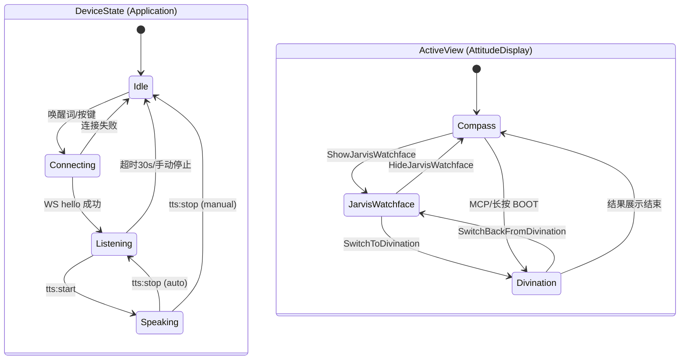
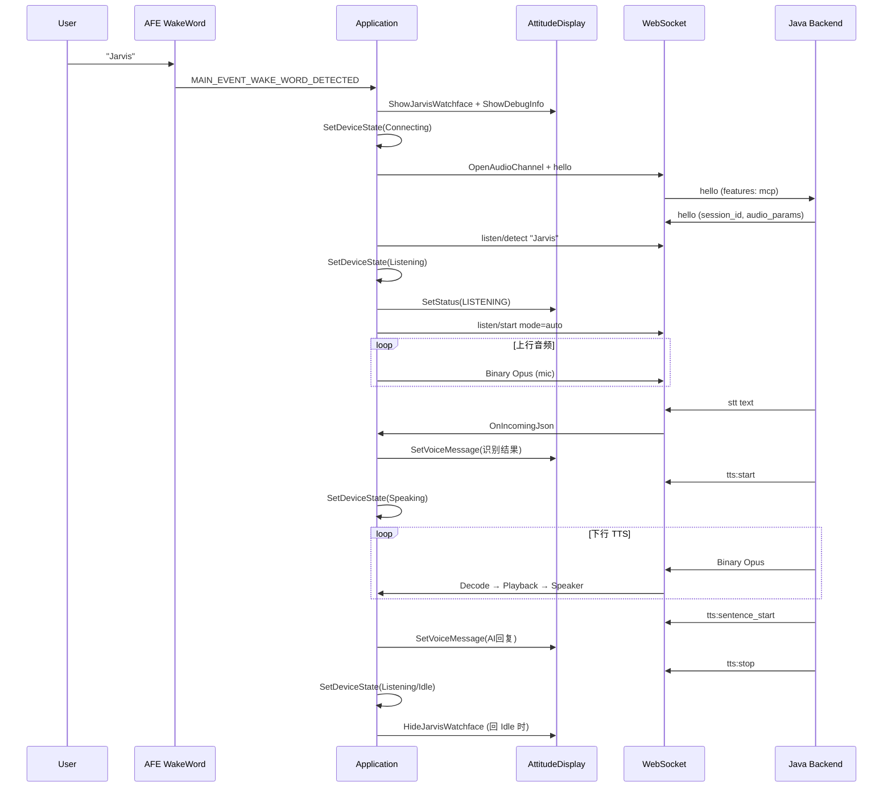

# 小智 ESP32 项目：UI 与语音交互逻辑梳理 + 内存分析

> 分析时间：2026-07-14  
> 目标板：**Waveshare ESP32-S3-Touch-LCD-1.85B**（ESP32-S3R8）  
> 固件版本：**2.2.6** | 屏幕：**360×360** 圆形 LCD

---

## 一、硬件内存基线

| 资源 | 容量 | 用途定位 |
|------|------|----------|
| **Internal SRAM** | **512 KB**（片上） | WiFi/LWIP、DMA 缓冲、FreeRTOS 栈、小对象分配 |
| **PSRAM** | **8 MB**（叠封 Octal） | AFE 模型、大图/GIF、LVGL 图片缓存、HTTP 栈 |
| **Flash** | 16 MB | 固件 + assets |

`sdkconfig.defaults.esp32s3` 关键策略：

- `CONFIG_SPIRAM_MALLOC_RESERVE_INTERNAL=98304` — 为 WiFi/LWIP **预留 96KB 内部 SRAM**
- `CONFIG_SPIRAM_MALLOC_ALWAYSINTERNAL=2048` — **<2KB 分配走内部 RAM**
- `CONFIG_MBEDTLS_EXTERNAL_MEM_ALLOC=y` — TLS 走 PSRAM

**健康水位线**（`/api/device/status`）：

| `min_free_internal` | 风险等级 |
|---------------------|----------|
| < 4 KB | `critical` — 易 OOM / 系统冻结 |
| < 8 KB | `high` |
| < 16 KB | `moderate` |
| ≥ 16 KB | `low` |

实测：正常运行约 **20–35 KB** free SRAM；语音唤醒 + JARVIS 动画期间 `minimal_sram` 可跌至 **4–13 KB**（见 `issues/2026-07-13-jarvis-wake-reboot-lvgl-lock.md`）。

---

## 二、双层状态机架构

项目用 **两套状态机** 协同工作：



| 层 | 枚举 | 管理者 | 职责 |
|----|------|--------|------|
| **设备状态** | `DeviceState` | `DeviceStateMachine` | 音频管线、协议、唤醒词开关 |
| **显示视图** | `ActiveView` | `AttitudeDisplay` | 罗盘 / JARVIS HUD / 占卜跑马灯 |
| **占卜子状态** | `FortuneDivinationState` | `AttitudeDisplay` | Idle → Animating → Result |

---

## 三、UI 交互逻辑

### 3.1 视觉分层（360×360 罗盘）

```
┌─────────────────────────────────────┐
│  L4 外边界环 (r=178)                 │
│  ┌───────────────────────────────┐  │
│  │ 12 运势菜单环 (r=132)          │  │
│  │  ┌─────────────────────────┐  │  │
│  │  │ 太极阴阳鱼 (r=86)        │  │  │
│  │  │  上鱼眼=WiFi  下鱼眼=BLE │  │  │
│  │  └─────────────────────────┘  │  │
│  └───────────────────────────────┘  │
│  DebugInfoCard / 功能区卡片        │
└─────────────────────────────────────┘
```

**关键类**：

| 类/文件 | 职责 |
|---------|------|
| `AttitudeDisplay` | 主 UI 控制器，重写 `SetStatus`/`SetChatMessage`/`ShowNotification` |
| `CompassTaiji` | 太极 canvas + 2 份 PSRAM 快照（零开销切换） |
| `FortuneWatchfaceView` | JARVIS HUD 单例（扫描弧、轨道动画、状态栏） |
| `DisplayLockGuard` | RAII 锁，**2s 超时**（`display.h`） |

### 3.2 按键交互（非语音路径）

| 操作 | 行为 |
|------|------|
| BOOT 短按 | 循环选中 12 项运势菜单 |
| BOOT 长按 3s | 启动占卜跑马灯 |
| 电源键 | 取消选中 / 关闭结果卡 |

### 3.3 JARVIS HUD 消息路由

当 `fortune_watchface_visible_ == true` 时，`AttitudeDisplay` **绕过 DebugInfoCard**，直接写入 HUD 状态栏：

| 调用来源 | HUD 显示 |
|----------|----------|
| `SetStatus("LISTENING")` | `SetStatusText` |
| `SetChatMessage("user", text)` | `SetVoiceMessage("#你:…")` |
| `SetChatMessage("assistant", text)` | `SetVoiceMessage("#AI:…")` |
| `ShowDebugInfo("识别到", text)` | `SetVoiceMessage` |
| `ShowNotification(...)` | `SetVoiceMessage("通知:…")` |

**设计意图**：JARVIS 路径 **跳过 `DisplayLockGuard`**，改用 `lvgl_port_lock(300ms)`，降低与 LVGL tick 的死锁风险。

### 3.4 占卜流程（MCP 触发）

```
MCP: self.attitude.start_divination
  → SwitchToDivination()
      → HideJarvisWatchface()（若从 JARVIS 进入）
      → StartFortuneDivinationUnlocked()
          → 25ms tick 跑马灯（最长 ~30s）
          → FinishFortuneDivinationUnlocked()
              → 若来自 JARVIS：2s 后 SwitchBackFromDivination()
              → 否则：立即 divination_callback_ → 上报 result
```

---

## 四、语音交互逻辑

### 4.1 事件驱动主循环

`Application::Run()` 等待 `MAIN_EVENT_*` 事件组：

```
AudioService 回调
  on_wake_word_detected → MAIN_EVENT_WAKE_WORD_DETECTED
  on_send_queue_available → MAIN_EVENT_SEND_AUDIO
  on_vad_change → MAIN_EVENT_VAD_CHANGE
  on_playback_finished → 状态恢复逻辑

Protocol 回调
  OnIncomingJson → 解析 stt/tts/llm/mcp
  OnIncomingAudio → PushPacketToDecodeQueue
```

### 4.2 完整语音 E2E 流程



### 4.3 各状态下的音频策略

| DeviceState | 唤醒词 | 语音处理 (AFE) | 解码器 |
|-------------|--------|----------------|--------|
| **Idle** | ON | OFF | — |
| **Connecting** | 保持 | — | — |
| **Listening** | OFF | ON (VAD→Opus 上行) | — |
| **Speaking** | 可选 ON | OFF | `ResetDecoder()` |

**幂等保护**（`audio_service.cc`）：`EnableWakeWordDetection` / `EnableVoiceProcessing` 重复调用直接返回，避免 AFE pipeline 频繁重建导致 SRAM 抖动。

### 4.4 音频队列与内存

| 队列 | 上限 | 估算内存 |
|------|------|----------|
| `audio_send_queue_` | 40 包 × ~60ms | ~40 × (Opus ~200B + vector overhead) ≈ **10–20 KB** |
| `audio_decode_queue_` | 40 包 | 同上 |
| `audio_playback_queue_` | 2 帧 PCM | ~2 × 60ms × 24kHz × 2B ≈ **6 KB** |
| Wake-word PCM ring | 64 KB max | **64 KB**（AFE 内部） |
| Encode task stack | 24 KB | **PSRAM** |

---

## 五、内存预算地图

### 5.1 必须占用 Internal SRAM（不可移 PSRAM）

| 组件 | 估算 | 说明 |
|------|------|------|
| LVGL 绘制缓冲 | **~52 KB** | 360×72 行 × RGB565，**DMA 内部 RAM**（PSRAM 会白屏） |
| WiFi/LWIP 预留 | **96 KB** | `SPIRAM_MALLOC_RESERVE_INTERNAL` |
| FreeRTOS 任务栈（内部） | **~30–50 KB** | audio_input(8K) + opus_codec(24K) + 系统任务 |
| NimBLE | **~8 KB** | `BT_NIMBLE_TASK_STACK_SIZE=4096` × 2 |
| **合计固定占用** | **~180–200 KB** | 512KB 中约 **40%** 已被系统+显示锁定 |

### 5.2 PSRAM 主要消费者

| 组件 | 估算 | 文件 |
|------|------|------|
| LVGL 图片缓存 | **2 MB** | `lcd_display.cc`（8MB PSRAM 板） |
| AFE/SR 模型 | **~2–4 MB** | `AFE_MEMORY_ALLOC_MORE_PSRAM` |
| 太极 canvas + 2 快照 | **~355 KB** | 172×172×4 × 3 |
| Wake-word encode 栈 | **24 KB** | `afe_wake_word.cc` |
| JARVIS orbit canvas | **4 KB** | `fortune_watchface_view.cc` |
| HTTP handler 栈 | **8–16 KB/请求** | `sdcard_log_http.cc` PSRAM 栈 |
| GIF/预览图（临时） | **文件大小** | MCP 图片工具、百度 GIF 搜索 |
| mbedtls TLS | 动态 | 外部内存分配 |

**PSRAM 余量充裕**（8MB 中常用 3–5MB），瓶颈在 **Internal SRAM**。

---

## 六、内存泄漏与风险点

### 6.1 已确认 / 高置信度风险

| # | 问题 | 位置 | 严重度 | 说明 |
|---|------|------|--------|------|
| 1 | **`audio_send_queue_` Stop 时未清空** | `audio_service.cc:178–192` | 中 | `Stop()` 清 encode/decode/playback，但 **send 队列残留** |
| 2 | **AFE 检测任务无销毁路径** | `afe_wake_word.cc` | 低 | `audio_detection` 任务创建后无 `vTaskDelete` |
| 3 | **GIF 用 `malloc` 非 PSRAM** | `attitude_display.cc:656` | 中 | 大 GIF 可能挤占内部 SRAM |
| 4 | **占卜一次性 lv_timer 未命名追踪** | `attitude_display.cc:1196` | 低 | 2s 回调 timer 靠自删，异常路径可能泄漏 |
| 5 | **LVGL 锁竞争 → 系统冻结** | `fortune_watchface_view.cc` | **高** | `SetVoiceMessage` 300ms 超时后仍可能与其他锁冲突 |
| 6 | **Decode 队列满丢包** | `application.cc` | 中 | `PushPacketToDecodeQueue(wait=false)`，TTS 音频静默丢失 |
| 7 | **预览图/GIF 缓存未及时释放** | `preview_image_cache_` | 中 | 多次 MCP 图片调用叠加 |
| 8 | **LVGL 图片缓存 2MB 常驻** | `lcd_display.cc` | 低（PSRAM） | 占用 PSRAM 但非泄漏；可考虑按需缩小 |

### 6.2 非泄漏但会触发 OOM 的叠加场景

```
语音唤醒 JARVIS
  + ShowJarvisWatchface (DisplayLockGuard 2s)
  + AFE 语音处理启动
  + MCP tools/list JSON 解析
  + SetVoiceMessage × N (LVGL reflow)
  + 若同时占卜跑马灯 (25ms tick × 12 label 重绘)
  + 若 MCP 下发 GIF/大图
  → Internal SRAM 跌至 <8KB → LVGL lock timeout → 系统冻结/重启
```

这正是 v2 E2E 分析中 **占卜 + TTS 期间设备重启** 的根因链。

---

## 七、内存优化建议（按优先级）

### P0 — 保护 Internal SRAM 水位线

| 建议 | 预期收益 | 改动点 |
|------|----------|--------|
| **GIF/大文件强制 PSRAM 分配** | 避免一次 GIF 吃掉 50–200KB SRAM | `attitude_display.cc` `malloc` → `heap_caps_malloc(..., SPIRAM)` |
| **`audio_send_queue_.clear()` 加入 `Stop()`** | 防止残留包占内存 | `audio_service.cc` |
| **占卜动画期间暂停 JARVIS 33ms timer** | 减少 LVGL 竞争 | `SwitchToDivination` 时 `lv_timer_pause(timer_)` |
| **LVGL 锁统一策略** | 消除双锁体系 | JARVIS 路径也走 `DisplayLockGuard`，或全局降为单锁 |

### P1 — PSRAM 利用优化

| 建议 | 说明 |
|------|------|
| **LVGL 图片缓存 2MB → 512KB–1MB** | 8MB PSRAM 板仍充裕，但可让给 GIF 临时缓冲 |
| **预览图解码后立即 `lv_image_cache_drop`** | 已有部分实现，MCP 路径需全覆盖 |
| **HTTP GIF 搜索显示**（`plan_baidu_gif_search_display.md`）| 下载 → PSRAM → 显示 → 定时释放，避免常驻 |

### P2 — 架构层优化

| 建议 | 说明 |
|------|------|
| **占卜 MCP 响应异步化** | 设备端先返回"已启动"，动画后台跑，避免 8s 阻塞 |
| **FadeViewTransition 启用或删除** | `FadeViewTransitionUnlocked` 已定义未使用，减少死代码 |
| **DebugInfo 队列上限 5 条** | 已有；JARVIS 模式下应确保 `lv_timer` 成对删除 |
| **监听超时 30s 与 TTS 竞态** | 已有 guard；可缩短到 15s 减少长会话内存占用 |

### P3 — 监控与诊断

```bash
# 实时查看内存水位
curl -s http://<设备IP>:8080/api/device/status | jq '{free_internal, min_free_internal, free_spiram, internal_sram_risk}'
```

建议在 `HandleStateChangedEvent` 各分支打 **SRAM 水位日志**（仅 DEBUG 构建），便于定位哪次状态切换导致 `minimal_sram` 下跌。

---

## 八、UI × 语音联合时序（典型 Jarvis 会话）

```
时间轴 ─────────────────────────────────────────────────────────►

[Idle]  罗盘待机，唤醒词 ON，太极自转 60s/圈
  │
  ├─ "Jarvis" 唤醒
  │    UI: Compass → JARVIS HUD（扫描动画 33ms tick 启动）
  │    Audio: WakeWord OFF
  │    Protocol: connecting → listen/detect
  │
  ├─ [Listening] 等待用户说话
  │    UI: HUD 显示 "LISTENING"
  │    Audio: AFE 上行 Opus
  │
  ├─ 服务器 STT 返回
  │    UI: HUD 显示 "#你: 开启占卜"
  │
  ├─ MCP start_divination
  │    UI: JARVIS → 隐藏 → 罗盘跑马灯（25ms tick，~30s）
  │    ⚠ 内存压力峰值区
  │
  ├─ [Speaking] TTS 播报
  │    UI: HUD 或 DebugCard 显示 AI 文本
  │    Audio: Opus 解码 → 扬声器
  │
  └─ [Idle] 会话结束
       UI: HideJarvisWatchface → 回到罗盘
       Audio: WakeWord ON
```

---

## 九、总结

| 维度 | 结论 |
|------|------|
| **UI 架构** | 双状态机（DeviceState + ActiveView），JARVIS HUD 为语音专属覆盖层，消息路由按 `fortune_watchface_visible_` 分流 |
| **语音架构** | 单线程事件循环 + 三任务音频管线；STT/LLM/TTS 在服务端，设备负责 Opus 编解码与协议 |
| **内存瓶颈** | **Internal SRAM（512KB）**，非 PSRAM（8MB）；LVGL DMA 缓冲 + WiFi 预留吃掉约 150KB |
| **主要风险** | LVGL 锁竞争、占卜+TTS 叠加、GIF 内部 malloc、音频队列残留 |
| **优化方向** | 大缓冲走 PSRAM、统一 LVGL 锁、占卜与 JARVIS 动画互斥、缩小图片缓存 |

---

## 十、相关文件索引

| 功能 | 路径 |
|------|------|
| 应用主循环 / 唤醒词 | `main/application.cc` |
| 设备状态机 | `main/device_state_machine.cc` |
| 罗盘 UI | `main/display/attitude_display.cc` |
| JARVIS HUD | `main/display/fortune_watchface_view.cc` |
| 太极图 | `main/display/compass_taiji.cc` |
| LVGL 显示初始化 | `main/display/lcd_display.cc` |
| 音频服务 | `main/audio/audio_service.cc` |
| 唤醒词 AFE | `main/audio/wake_words/afe_wake_word.cc` |
| WebSocket 协议 | `main/protocols/websocket_protocol.cc` |
| MCP 工具 | `main/mcp_server.cc` |
| 内存状态 API | `main/sdcard_log_http.cc`（`/api/device/status`） |
| 板型规格 | `doc/WAVESHARE_ESP32_S3_TOUCH_LCD_1_85B.md` |
| LVGL 锁竞争问题 | `issues/2026-07-13-jarvis-wake-reboot-lvgl-lock.md` |
| HUD 状态栏语音显示 | `issues/2026-07-13-jarvis-hud-status-bar-voice-display.md` |
