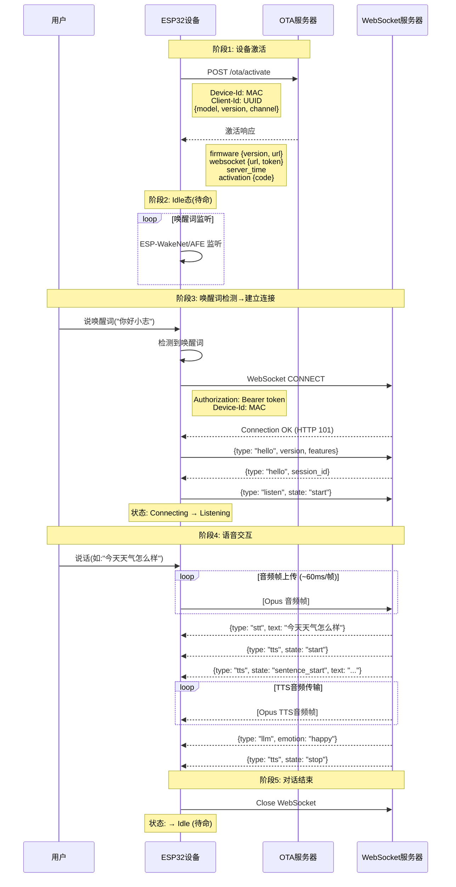

# 小智 AI 与后台服务器交互协议汇总

> **文档版本**: v1.1
> **更新日期**: 2026-06-19
> **项目路径**: `xiaozhi-esp32`

---

## 一、服务器地址配置

### 1. OTA 服务器地址（激活与固件升级）

| 配置项 | 地址 | 用途 |
|-------|------|------|
| **OTA 检查版本 URL** | `https://api.tenclass.net/xiaozhi/ota/` | 设备激活、获取 WebSocket 配置、检查固件版本 |
| **本地 OTA 服务器** | `http://192.168.3.24:8003` | 本地部署时使用 |
| 代码定义 | [main/Kconfig.projbuild#L3](file:///Users/sfan/Desktop/cv/github/OpenMAIC/xiaozhi-esp32/main/Kconfig.projbuild#L3) | `CONFIG_OTA_URL` |
| 运行时读取 | [main/ota.cc#L46-52](file:///Users/sfan/Desktop/cv/github/OpenMAIC/xiaozhi-esp32/main/ota.cc#L46-L52) | `Ota::GetCheckVersionUrl()` |

### 2. WebSocket 服务器地址（语音交互）

| 配置项 | 地址 | 用途 |
|-------|------|------|
| **默认服务器** | `xiaozhi.me` 官方服务器 | 语音唤醒、语音识别、LLM 对话、TTS 合成 |
| **本地服务器** | `ws://192.168.3.24:8000/xiaozhi/v1/` | 本地部署时使用 |
| **智控台** | `http://192.168.3.24:8002` | 设备管理、参数配置 |
| **运行时获取** | 从 OTA 激活响应中获取 | 存储在 NVS `websocket` namespace |
| URL 读取 | [main/protocols/websocket_protocol.cc#L84-85](file:///Users/sfan/Desktop/cv/github/OpenMAIC/xiaozhi-esp32/main/protocols/websocket_protocol.cc#L84-L85) | `Settings settings("websocket", false);` |

### 3. URL 配置来源流程

```
编译时 CONFIG_OTA_URL (默认)
        ↓
运行时 NVS wifi.ota_url (可覆盖)
        ↓
Ota::GetCheckVersionUrl() 返回最终 URL
        ↓
HTTP POST /activate → 服务器返回 websocket.url
        ↓
存储到 NVS websocket.url (持久化)
```

---

## 二、完整交互序列图



---

## 三、完整交互流程

### 阶段 1：设备激活（获取服务器配置）

**触发时机**：设备首次配网完成或每次启动时

#### 1.1 HTTP 请求

```
POST https://api.tenclass.net/xiaozhi/ota/activate
或
GET https://api.tenclass.net/xiaozhi/ota/

Headers:
  Device-Id: <MAC地址，格式如 A4:CF:12:XX:XX:XX>
  Client-Id: <UUID，擦除 NVS 后会重新生成>
  Activation-Version: "1" 或 "2"
  User-Agent: <设备信息JSON，包含芯片型号、固件版本等>
  Accept-Language: <语言代码，如 zh-CN>
  Content-Type: application/json (POST 时)
```

#### 1.2 设备信息 JSON（POST 请求体）

```json
{
  "model": "waveshare-esp32-s3-touch-lcd-1.85b",
  "manufacturer": "waveshare",
  "version": "1.14.0",
  "channel": "official"
}
```

#### 1.3 服务器响应 JSON

```json
{
  "firmware": {
    "version": "1.14.0",
    "url": "https://api.tenclass.net/xiaozhi/ota/firmware/..."
  },
  "websocket": {
    "url": "wss://xxx.xiaozhi.me/...",
    "token": "Bearer xxxxxxxx",
    "version": 1
  },
  "server_time": {
    "timestamp": 1750099200,
    "timezone_offset": 8
  },
  "activation": {
    "code": "ACTIVATION_CODE",
    "message": "欢迎使用小智",
    "timeout_ms": 30000
  }
}
```

#### 1.4 配置存储

| NVS Namespace | Key | 来源 |
|--------------|-----|------|
| `wifi` | `ota_url` | 可选覆盖 |
| `websocket` | `url` | 激活响应 |
| `websocket` | `token` | 激活响应（Bearer 令牌） |
| `websocket` | `version` | 激活响应（协议版本 1/2/3） |

**代码位置**：[main/ota.cc#L168-186](file:///Users/sfan/Desktop/cv/github/OpenMAIC/xiaozhi-esp32/main/ota.cc#L168-L186)

---

### 阶段 2：Idle 态（待命）

**设备状态**：屏幕显示 **"待命"**，表情为 `neutral`

**设备行为**：
- 麦克风持续监听唤醒词（WakeWord 后台运行）
- **不与服务器保持任何连接**
- 低功耗模式运行

**代码位置**：[main/protocols/websocket_protocol.cc#L23-26](file:///Users/sfan/Desktop/cv/github/OpenMAIC/xiaozhi-esp32/main/protocols/websocket_protocol.cc#L23-L26)

```cpp
bool WebsocketProtocol::Start() {
    // Only connect to server when audio channel is needed
    return true;  // ← 空操作，不建立连接
}
```

---

### 阶段 3：唤醒词检测 → 建立 WebSocket 连接

**触发时机**：用户说唤醒词（如"你好小志"）或短按 BOOT 键

#### 3.1 唤醒词检测事件

```
ESP-WakeNet / AFE 检测到唤醒词
    ↓
回调 on_wake_word_detected()
    ↓
主循环捕获 → HandleWakeWordDetectedEvent()
    ↓
状态转换: Idle → Connecting
```

**代码位置**：[main/application.cc#L872-916](file:///Users/sfan/Desktop/cv/github/OpenMAIC/xiaozhi-esp32/main/application.cc#L872-L916)

#### 3.2 建立 WebSocket 连接

```
WebSocket CONNECT <websocket.url>
Headers:
  Authorization: Bearer <token>
  Protocol-Version: 1
  Device-Id: <MAC地址>
  Client-Id: <UUID>
```

#### 3.3 设备发送 hello

```
→ WebSocket Text Frame:
{
  "type": "hello",
  "version": 1,
  "features": {
    "mcp": true,
    "aec": true  // 仅当 CONFIG_USE_SERVER_AEC 启用
  },
  "transport": "websocket",
  "audio_params": {
    "format": "opus",
    "sample_rate": 16000,
    "channels": 1,
    "frame_duration": 60
  }
}
```

**代码位置**：[main/protocols/websocket_protocol.cc#L203-226](file:///Users/sfan/Desktop/cv/github/OpenMAIC/xiaozhi-esp32/main/protocols/websocket_protocol.cc#L203-L226)

#### 3.4 服务器返回 hello

```
← WebSocket Text Frame:
{
  "type": "hello",
  "transport": "websocket",
  "session_id": "abc123xyz",
  "audio_params": {
    "format": "opus",
    "sample_rate": 24000,
    "channels": 1,
    "frame_duration": 60
  }
}
```

> 设备记录 `session_id`，确认连接成功。

#### 3.5 发送唤醒词信息（可选）

```
#if CONFIG_SEND_WAKE_WORD_DATA
→ WebSocket Binary Frame: [Opus 编码的唤醒词音频]
→ WebSocket Text Frame:
{
  "session_id": "abc123xyz",
  "type": "listen",
  "state": "detect",
  "text": "你好小志"
}
#endif
```

#### 3.6 开始聆听

```
→ WebSocket Text Frame:
{
  "session_id": "abc123xyz",
  "type": "listen",
  "state": "start",
  "mode": "auto"  // 或 "manual" / "realtime"
}
```

**代码位置**：[main/protocols/protocol.cc#L57-68](file:///Users/sfan/Desktop/cv/github/OpenMAIC/xiaozhi-esp32/main/protocols/protocol.cc#L57-L68)

#### 3.7 状态转换

```
Connecting → Listening
屏幕显示: "聆听中..."
表情变为: "listening"
```

---

### 阶段 4：语音交互（双向数据传输）

#### 4.1 设备 → 服务器：上传用户语音

```
麦克风采集 → VAD 检测 → Opus 编码 → 放入发送队列
    ↓ (主循环 ~60ms 一次)
→ WebSocket Binary Frame: [Opus 音频帧]
```

**发送格式**：

| 协议版本 | 格式 |
|---------|------|
| 版本 1 | 直接发送 Opus 二进制帧 |
| 版本 2 | BinaryProtocol2 { version, type, reserved, timestamp, payload_size, payload[] } |
| 版本 3 | BinaryProtocol3 { type, reserved, payload_size, payload[] } |

**代码位置**：
- [main/protocols/websocket_protocol.cc#L28-58](file:///Users/sfan/Desktop/cv/github/OpenMAIC/xiaozhi-esp32/main/protocols/websocket_protocol.cc#L28-L58)
- [main/application.cc#L293-295](file:///Users/sfan/Desktop/cv/github/OpenMAIC/xiaozhi-esp32/main/application.cc#L293-L295)

#### 4.2 服务器 → 设备：语音识别结果

```
← WebSocket Text Frame:
{
  "session_id": "abc123xyz",
  "type": "stt",
  "text": "今天天气怎么样"
}
```

> 设备处理：屏幕显示用户说的话

#### 4.3 服务器 → 设备：TTS 开始

```
← WebSocket Text Frame:
{
  "session_id": "abc123xyz",
  "type": "tts",
  "state": "start"
}
```

> 设备处理：停止录音，状态变为 Speaking，开始播放音频

#### 4.4 服务器 → 设备：TTS 句子开始

```
← WebSocket Text Frame:
{
  "session_id": "abc123xyz",
  "type": "tts",
  "state": "sentence_start",
  "text": "今天天气晴朗"
}
```

> 设备处理：屏幕显示 TTS 文本内容

#### 4.5 服务器 → 设备：TTS 音频数据

```
← WebSocket Binary Frame: [Opus 编码的 TTS 音频]
```

> 设备处理：Opus 解码 → 重采样（如需要）→ 音频播放

#### 4.6 服务器 → 设备：TTS 结束

```
← WebSocket Text Frame:
{
  "session_id": "abc123xyz",
  "type": "tts",
  "state": "stop"
}
```

> 设备处理：根据 ListeningMode 决定回到 Listening 或 Idle

**服务端代码位置**：[sendAudioHandle.py](file:///Users/sfan/Desktop/cv/github/OpenMAIC/xiaozhi-esp32-server/main/xiaozhi-server/core/handle/sendAudioHandle.py)

#### 4.7 服务器 → 设备：表情更新

```
← WebSocket Text Frame:
{
  "session_id": "abc123xyz",
  "type": "llm",
  "emotion": "happy"
}
```

> 设备处理：更新表情图标显示

#### 4.8 服务器 → 设备：MCP 工具调用

```
← WebSocket Text Frame:
{
  "session_id": "abc123xyz",
  "type": "mcp",
  "payload": {
    "jsonrpc": "2.0",
    "method": "tools/call",
    "params": {
      "name": "self.light.set_rgb",
      "arguments": { "r": 255, "g": 0, "b": 0 }
    },
    "id": 1
  }
}
```

> 设备处理：解析 JSON-RPC，执行工具调用，返回结果

**服务端代码位置**：
- MCP 客户端：[mcp_client.py](file:///Users/sfan/Desktop/cv/github/OpenMAIC/xiaozhi-esp32-server/main/xiaozhi-server/core/providers/tools/server_mcp/mcp_client.py)
- MCP 消息处理：[mcp_endpoint_handler.py](file:///Users/sfan/Desktop/cv/github/OpenMAIC/xiaozhi-esp32-server/main/xiaozhi-server/core/providers/tools/mcp_endpoint/mcp_endpoint_handler.py)

---

### 阶段 5：对话结束 → 关闭连接

#### 5.1 正常结束

```
服务器发送 tts.stop
    ↓
ListeningMode = ManualStop → Idle（回到待命）
或
ListeningMode = AutoStop → 再次进入 Listening
    ↓
设备主动关闭 WebSocket:
CloseAudioChannel() → websocket_.reset()
    ↓
回到 Idle 态
```

#### 5.2 用户打断

```
用户再次唤醒 / 电源键短按
    ↓
→ WebSocket Text Frame:
{
  "session_id": "abc123xyz",
  "type": "abort",
  "reason": "wake_word_detected"
}
    ↓
websocket_.reset() → 重新建立连接
```

**代码位置**：[main/protocols/protocol.cc#L41-49](file:///Users/sfan/Desktop/cv/github/OpenMAIC/xiaozhi-esp32/main/protocols/protocol.cc#L41-L49)

---

## 四、消息类型汇总

### 4.1 设备 → 服务器消息

| type | 用途 | 示例 |
|------|------|------|
| `hello` | 连接握手 | 包含版本、功能、音频参数 |
| `listen` | 聆听状态 | state: start/detect/stop |
| `abort` | 中断说话 | reason: wake_word_detected |
| `mcp` | 物联网控制 | JSON-RPC 2.0 格式 |
| Binary | 音频数据 | Opus 编码的语音数据 |

### 4.2 服务器 → 设备消息

| type | 用途 | 示例 |
|------|------|------|
| `hello` | 服务器握手确认 | 返回 session_id、音频参数 |
| `stt` | 语音识别结果 | 用户说的话 |
| `tts` | TTS 状态控制 | start/stop/sentence_start |
| `llm` | 大模型响应 | 表情更新 |
| `mcp` | 工具调用请求 | JSON-RPC 2.0 格式 |
| `system` | 系统命令 | reboot 等 |
| `custom` | 自定义消息 | 可选功能 |
| Binary | 音频数据 | Opus 编码的 TTS 音频 |

---

## 五、状态机转换

```
┌──────────────────────────────────────────────────────────────────┐
│                                                                  │
│  ┌─────────────┐  配网完成  ┌─────────────┐  激活完成  ┌────────┐│
│  │  Starting   │ ─────────► │  Activating │ ─────────► │  Idle  ││
│  └─────────────┘            └─────────────┘            └───┬────┘│
│                                                             │     │
│                    ┌────────────────────────────────────────┘     │
│                    │ 唤醒 / BOOT 短按                            │
│                    ▼                                            │
│             ┌─────────────┐                                      │
│             │ Connecting  │ ──── 超时 10s ────► 回到 Idle        │
│             └──────┬──────┘                                      │
│                    │ WebSocket 连接成功                           │
│                    │ 服务器返回 hello                             │
│                    ▼                                            │
│             ┌─────────────┐                                      │
│             │  Listening  │ ──── 电源键 ────► 回到 Idle          │
│             └──────┬──────┘                                      │
│                    │ 服务器返回 tts.start                         │
│                    ▼                                            │
│             ┌─────────────┐                                      │
│             │  Speaking   │ ──── tts.stop ──┬──► Listening      │
│             └─────────────┘                 └──► Idle           │
│                                                                  │
└──────────────────────────────────────────────────────────────────┘
```

---

## 六、关键代码文件索引

| 功能 | 文件路径 |
|------|---------|
| 激活与配置获取 | [main/ota.cc](file:///Users/sfan/Desktop/cv/github/OpenMAIC/xiaozhi-esp32/main/ota.cc) |
| WebSocket 协议实现 | [main/protocols/websocket_protocol.cc](file:///Users/sfan/Desktop/cv/github/OpenMAIC/xiaozhi-esp32/main/protocols/websocket_protocol.cc) |
| 协议基类 | [main/protocols/protocol.cc](file:///Users/sfan/Desktop/cv/github/OpenMAIC/xiaozhi-esp32/main/protocols/protocol.cc) |
| 唤醒词处理 | [main/application.cc](file:///Users/sfan/Desktop/cv/github/OpenMAIC/xiaozhi-esp32/main/application.cc) (L872-949) |
| 状态机 | [main/application.cc](file:///Users/sfan/Desktop/cv/github/OpenMAIC/xiaozhi-esp32/main/application.cc) (L108-120) |
| 音频服务 | [main/audio/audio_service.cc](file:///Users/sfan/Desktop/cv/github/OpenMAIC/xiaozhi-esp32/main/audio/audio_service.cc) |
| 唤醒词检测 | [main/audio/wake_words/esp_wake_word.cc](file:///Users/sfan/Desktop/cv/github/OpenMAIC/xiaozhi-esp32/main/audio/wake_words/esp_wake_word.cc) |
| WebSocket 协议文档 | [docs/websocket_zh.md](file:///Users/sfan/Desktop/cv/github/OpenMAIC/xiaozhi-esp32/docs/websocket_zh.md) |

---

## 七、调试与日志

### 7.1 关键日志标签

| 日志标签 | 内容 |
|---------|------|
| `WS` | WebSocket 连接和消息 |
| `OTA` | 激活和固件升级 |
| `APP` | 应用主循环和状态机 |
| `audio_service` | 音频采集和播放 |

### 7.2 串口日志关键词

```
Connecting to websocket server: xxx  ← WebSocket 连接地址
Session ID: xxx                     ← 会话标识
Wake word detected: xxx              ← 唤醒词命中
<< xxx                              ← TTS 显示文本
>> xxx                              ← STT 识别文本
Websocket disconnected              ← 连接断开
Failed to receive server hello       ← 握手超时
```

### 7.3 查看实时日志

```bash
# 使用项目脚本
./build_and_flash.sh monitor

# 或直接使用 esptool
python3 -m esptool --port /dev/cu.usbmodem1101 monitor
```

---

## 八、相关文档

| 文档 | 说明 |
|------|------|
| [websocket_zh.md](file:///Users/sfan/Desktop/cv/github/OpenMAIC/xiaozhi-esp32/docs/websocket_zh.md) | WebSocket 通信协议详细说明 |
| [mcp-protocol_zh.md](file:///Users/sfan/Desktop/cv/github/OpenMAIC/xiaozhi-esp32/docs/mcp-protocol_zh.md) | MCP 物联网控制协议 |
| [mcp-usage_zh.md](file:///Users/sfan/Desktop/cv/github/OpenMAIC/xiaozhi-esp32/docs/mcp-usage_zh.md) | MCP 使用指南 |

## 九、服务端代码索引

### 9.1 OTA 和设备激活

| 功能 | 文件路径 |
|------|---------|
| OTA 接口控制器 | [OTAController.java](file:///Users/sfan/Desktop/cv/github/OpenMAIC/xiaozhi-esp32-server/main/manager-api/src/main/java/xiaozhi/modules/device/controller/OTAController.java) |
| OTA 响应 DTO | [DeviceReportRespDTO.java](file:///Users/sfan/Desktop/cv/github/OpenMAIC/xiaozhi-esp32-server/main/manager-api/src/main/java/xiaozhi/modules/device/dto/DeviceReportRespDTO.java) |
| 设备服务实现 | [DeviceServiceImpl.java](file:///Users/sfan/Desktop/cv/github/OpenMAIC/xiaozhi-esp32-server/main/manager-api/src/main/java/xiaozhi/modules/device/service/impl/DeviceServiceImpl.java) |
| Python OTA 处理器 | [ota_handler.py](file:///Users/sfan/Desktop/cv/github/OpenMAIC/xiaozhi-esp32-server/main/xiaozhi-server/core/api/ota_handler.py) |

### 9.2 WebSocket 消息处理

| 功能 | 文件路径 |
|------|---------|
| WebSocket 服务器 | [websocket_server.py](file:///Users/sfan/Desktop/cv/github/OpenMAIC/xiaozhi-esp32-server/main/xiaozhi-server/core/websocket_server.py) |
| 连接处理器 | [connection.py](file:///Users/sfan/Desktop/cv/github/OpenMAIC/xiaozhi-esp32-server/main/xiaozhi-server/core/connection.py) |
| Hello 消息处理 | [helloHandle.py](file:///Users/sfan/Desktop/cv/github/OpenMAIC/xiaozhi-esp32-server/main/xiaozhi-server/core/handle/helloHandle.py) |
| Listen 消息处理 | [listenMessageHandler.py](file:///Users/sfan/Desktop/cv/github/OpenMAIC/xiaozhi-esp32-server/main/xiaozhi-server/core/handle/textHandler/listenMessageHandler.py) |
| TTS 音频发送 | [sendAudioHandle.py](file:///Users/sfan/Desktop/cv/github/OpenMAIC/xiaozhi-esp32-server/main/xiaozhi-server/core/handle/sendAudioHandle.py) |
| 音频接收处理 | [receiveAudioHandle.py](file:///Users/sfan/Desktop/cv/github/OpenMAIC/xiaozhi-esp32-server/main/xiaozhi-server/core/handle/receiveAudioHandle.py) |

### 9.3 MCP 协议实现

| 功能 | 文件路径 |
|------|---------|
| MCP 客户端 | [mcp_client.py](file:///Users/sfan/Desktop/cv/github/OpenMAIC/xiaozhi-esp32-server/main/xiaozhi-server/core/providers/tools/server_mcp/mcp_client.py) |
| MCP 接入点处理 | [mcp_endpoint_handler.py](file:///Users/sfan/Desktop/cv/github/OpenMAIC/xiaozhi-esp32-server/main/xiaozhi-server/core/providers/tools/mcp_endpoint/mcp_endpoint_handler.py) |
| MCP 管理器 | [mcp_manager.py](file:///Users/sfan/Desktop/cv/github/OpenMAIC/xiaozhi-esp32-server/main/xiaozhi-server/core/providers/tools/server_mcp/mcp_manager.py) |
| MCP 配置 | [mcp_server_settings.json](file:///Users/sfan/Desktop/cv/github/OpenMAIC/xiaozhi-esp32-server/main/xiaozhi-server/mcp_server_settings.json) |

### 9.4 设备管理

| 功能 | 文件路径 |
|------|---------|
| 设备注册接口 | [DeviceController.java](file:///Users/sfan/Desktop/cv/github/OpenMAIC/xiaozhi-esp32-server/main/manager-api/src/main/java/xiaozhi/modules/device/controller/DeviceController.java) |
| 设备服务接口 | [DeviceService.java](file:///Users/sfan/Desktop/cv/github/OpenMAIC/xiaozhi-esp32-server/main/manager-api/src/main/java/xiaozhi/modules/device/service/DeviceService.java) |
| 验证码服务 | [CaptchaServiceImpl.java](file:///Users/sfan/Desktop/cv/github/OpenMAIC/xiaozhi-esp32-server/main/manager-api/src/main/java/xiaozhi/modules/security/service/impl/CaptchaServiceImpl.java) |

---

## 十、API 地址汇总

### 10.1 正式版服务器

| API 用途 | 正式版 URL | 请求方式 |
|---------|-----------|---------|
| OTA 激活与配置 | `https://api.tenclass.net/xiaozhi/ota/` | GET/POST |
| OTA 固件下载 | `https://api.tenclass.net/xiaozhi/ota/firmware/<version>` | GET |
| WebSocket 服务 | `wss://xxx.xiaozhi.me/xiaozhi/v1/` | WebSocket |

### 10.2 本地服务器

| API 用途 | 本地 URL | 请求方式 | 状态 |
|---------|---------|---------|------|
| OTA 激活与配置 | `http://192.168.3.24:8003/xiaozhi/ota/` | GET/POST | ✅ 服务正常 |
| OTA 固件下载 | `http://192.168.3.24:8003/xiaozhi/ota/download/<filename>` | GET | ✅ 服务正常 |
| 视觉分析接口 | `http://192.168.3.24:8003/mcp/vision/explain` | POST | ✅ 服务正常 |
| WebSocket 服务 | `ws://192.168.3.24:8000/xiaozhi/v1/` | WebSocket | ⚠️ 未验证 |
| 智控台管理 | `http://192.168.3.24:8002/` | HTTP | ✅ 服务正常 |

### 10.3 激活响应对照

| 响应字段 | 正式版示例 | 本地版配置 |
|---------|----------|----------|
| websocket.url | `wss://xxx.xiaozhi.me/...` | `ws://192.168.3.24:8000/xiaozhi/v1/` |
| websocket.token | `Bearer xxx` | 智控台注册设备后获取 |
| firmware.url | `https://api.tenclass.net/xiaozhi/ota/firmware/...` | `http://192.168.3.24:8003/xiaozhi/ota/download/<filename>` |

---

*本文档由 AI 助手根据代码分析整理生成*
*文档版本：v1.2 (2026-06-19 更新)*
